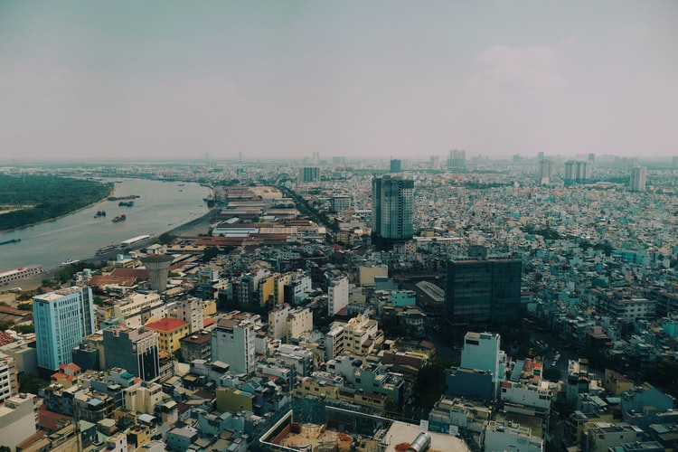

+++
author = "nguyenne"
title = "Chuyến đi về nhà"
date = "2021-02-17"
description = "Một ngày đặc biệt hơn mọi lần"
categories = ["life"]
tags = [
  "hometown",
  "journey"
]
+++

## Mon, 15 Feb, 2021

Sau những ngày tháng vui chơi, quây quần với gia đình trong những ngày Tết thì hôm nay cũng đến lúc tôi phải về nhà.
Như bao buổi sáng khác, tôi cứ nằm lì trên chiếc giường với chiếc mền ấm áp giữa cái thời tiết se se lạnh của những ngày Tết. Nhưng tôi đâu nhớ rằng hôm nay là ngày tôi phải về nhà, tôi cứ mải mê chìm đắm trong giấc ngủ cho đến khi ba tôi cằm cây **Ỷ thiên đồ long roi** ra và kêu tôi dậy. Tôi lập tức ngồi dậy chạy đi đánh răng, rửa mặt và đi ăn sáng cùng gia đình.

Khi đến quán, tôi lựa cho mình một dĩa cơm sườn thơm ngon( *thật ra là chỉ có mỗi món đó* ). Quả thật là nó không làm tôi phải thất vọng, nó thật sự ngon tuyệt vời. Thịt thì vừa ăn, canh thì ngọt nước, ngọt của vị xương heo hầm và nước dừa. Thật sự thì tôi không trông đợi nhiều gì ở dĩa cơm này, vì nó có 20 ngàn (tại tôi là một người theo tôn chỉ (**Tiền nào của nấy**) Nhưng nó vẫn thật sự rất ngon, có thể nói là dĩa cơm ngon nhất mà tôi từng ăn ở xứ Dừa này. Ăn xong rồi thì cũng đến lúc tôi phải chia tay với gia đình về nhà để còn chuẩn bị học online ( Học online nó còn khổ hơn đi học )

Bánh xe bắt đầu lăn, tôi dần dần rời xa thành phố Bến Tre, bây giờ thì nỗi lo lắng của tôi ngày một lớn hơn "**nỗi sợ kẹt xe**". Nhưng may thay, đường xá yên tĩnh, vắng lặng, thời tiết thì mát mẻ, quá ư là thích hợp để đánh một giấc trên xe.
Vừa mở mắt thì tôi đã tới một cây cầu rất quen, nhưng trong lúc tôi đang nửa tỉnh nửa mơ thì tôi chưa nhận ra được. Nhìn một hồi thì mới nhận ra đó là cầu vượt An Sương, thế là cuối cùng mình cũng sắp được về nhà rồi yee.
Thế là mình mở điện thoại ra, chụp liền một tấm hình check-in là mình đã về tới gần nhà rồi hihi

Cuối cùng thì mình cũng đã về nhà rùi, sau một kỳ nghỉ Tết dài hơn 10 ngày, thật sự thì có rất nhiều cảm xúc pha trộn vào trong đấy, nào là hạnh phúc, vui vẻ, ...
Cảm ơn mọi người vì đã cho tôi một cái Tết trọn vẹn, yêu mọi người <3

---

### nguyenne, Ho Chi Minh

> Reach me on [Facebook](https://www.facebook.com/nguyenisp/) [Instagram](https://www.instagram.com/nguyenne.205)